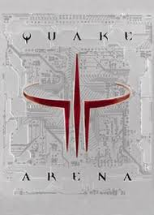

# 🎯 Enhanced Quake Coding Arena - MCP Server

[](https://smithery.ai/server/@Ripnrip/quake-coding-arena-mcp)
[](https://smithery.ai/server/@Ripnrip/quake-coding-arena)



**DOMINATING! EXCELLENT! GODLIKE! UNSTOPPABLE!** 🎯🔥

> **Premium TypeScript MCP Server for gamifying your development environment with authentic Quake 3 Arena sounds and dual voice announcers**

## 🚀 **Features**

### 🎮 **25 Epic Achievements**
- **Streak Achievements**: RAMPAGE, DOMINATING, UNSTOPPABLE, GODLIKE (both voices)
- **Quality Achievements**: EXCELLENT, PERFECT, IMPRESSIVE (male voice)
- **Multi-Kills**: WICKED SICK, HEADSHOT, MULTI KILL, ULTRA KILL, MONSTER KILL, LUDICROUS KILL, KILLING SPREE, DOUBLE KILL, TRIPLE KILL (both voices)
- **Game Events**: FIRST BLOOD, HUMILIATION, HOLY SHIT, BOTTOM FEEDER (both voices)
- **Team Events**: PREPARE TO FIGHT, PLAY (both voices)

### 🎤 **Dual Voice System**
- **Male Announcer**: Complete voice pack with 17 unique sounds
- **Female Announcer**: Complete voice pack with 16 unique sounds
- **Smart fallback** to male voice for unavailable female sounds
- **Volume control** (0-100%)
- **Cross-platform audio** support

### 🔧 **MCP Integration**
- **11 MCP Tools** for complete control
- **JSON-RPC 2.0** compliant
- **Session statistics** tracking
- **Category filtering** for achievements
- **Random achievement** selection
- **AI usage guide** integration
- **Voice pack testing** capabilities

## 📦 **Installation Options**

### **Option 1: Local Development Setup**

```bash
# Run local setup script
./setup-local.sh

# Or manually
npm install
npm run build
node run-server.ts
```

### **Option 2: Remote (Smithery) Deployment**

```bash
# Run remote setup script
./setup-remote.sh

# Or install from Smithery registry
smithery install quake-coding-arena-enhanced

# Or add to your MCP configuration
{
  "mcpServers": {
    "quake-arena": {
      "command": "npx",
      "args": ["@Ripnrip/quake-coding-arena-mcp"]
    }
  }
}
```

### **Option 3: GitHub Pages Website**

Visit the live soundboard at: **https://ripnrip.github.io/Quake-Coding-Arena-MCP/**

The website includes:
- ✅ Interactive soundboard with all 25 achievements
- ✅ Dual voice system (Male/Female toggle)
- ✅ Category filtering
- ✅ Volume control
- ✅ GitHub Pages ready

## 🎯 **Available MCP Tools**

### Core Achievement Tools
- `play_enhanced_quake_sound` - Trigger specific achievements
- `random_enhanced_achievement` - Random by category
- `list_enhanced_achievements` - Browse all achievements

### Control & Settings
- `set_enhanced_volume` - Set volume (0-100)
- `set_voice_pack` - Switch male/female voices
- `get_voice_pack_info` - Voice information

### Statistics & Guides
- `get_enhanced_achievement_stats` - Session statistics
- `get_enhanced_achievement_guide` - Achievement guide
- `get_ai_usage_guide` - Context-specific usage tips
- `test_voice_packs` - Test all voice packs

## 🎮 **Usage Examples**

```javascript
// Trigger a GODLIKE achievement at 80% volume
await session.call("tools/call", {
  name: "play_enhanced_quake_sound",
  arguments: {
    achievement: "GODLIKE",
    volume: 80,
    voiceGender: "female"
  }
});

// Get a random quality achievement
await session.call("tools/call", {
  name: "random_enhanced_achievement",
  arguments: {
    category: "quality",
    volume: 70
  }
});

// Switch to female voice pack
await session.call("tools/call", {
  name: "set_voice_pack",
  arguments: {
    voiceGender: "female"
  }
});
```

## 🔧 **Configuration**

The server automatically detects sound files and supports:
- **MP3 and WAV** audio formats
- **Custom sound directories**
- **Voice pack management**
- **Session persistence**

## 📁 **Project Structure**

```
quake-coding-arena-enhanced/
├── index.js              # Main MCP server
├── package.json           # NPM configuration
├── smithery.yaml         # Smithery configuration
├── sounds/               # Audio files
│   ├── male/            # Male announcer sounds
│   └── female/          # Female announcer sounds
├── README.md            # This file
└── test-mcp-server.cjs   # Test utilities
```

## 🏆 **Achievement Categories**

### 🔥 **Streak Achievements** (Both Voices)
- **RAMPAGE** (10) - Multiple quick tasks
- **DOMINATING** (15) - Complex problems solved
- **UNSTOPPABLE** (20) - Long productive sessions
- **GODLIKE** (25) - Legendary coding sessions

### ✨ **Quality Achievements** (Male Voice)
- **EXCELLENT** - Elegant solutions
- **PERFECT** - Flawless implementation
- **IMPRESSIVE** - Creative problem-solving

### ⚔️ **Multi-Kill Achievements** (Both Voices)
- **HEADSHOT** - Precision coding
- **DOUBLE KILL** - Two quick wins
- **MULTI KILL** - Multiple bugs squashed
- **KILLING SPREE** - Consistent productivity
- **TRIPLE KILL** - Triple efficiency
- **ULTRA KILL** - Exceptional performance
- **MONSTER KILL** - Massive code refactoring
- **LUDICROUS KILL** - Unbelievable solutions
- **WICKED SICK** - Mind-blowing solutions

### 🎪 **Game State Announcements** (Both Voices)
- **FIRST BLOOD** - First bug found
- **HUMILIATION** - Quick bug fixes
- **HOLY SHIT** - Unexpected breakthrough
- **BOTTOM FEEDER** - Learning from mistakes

### 👥 **Team Events** (Both Voices)
- **PREPARE TO FIGHT** - Team motivation
- **PLAY** - Game on, let's code!

## 🎯 **Perfect For**

- **Developers** wanting gamified coding environments
- **Teams** needing motivational feedback
- **Streamers** wanting engaging content
- **Educators** teaching coding concepts
- **Anyone** loving Quake 3 Arena nostalgia!

## 📊 **Requirements**

- **Node.js 18+** for MCP server
- **MCP-compatible** IDE (Cursor, Claude Desktop, etc.)
- **Audio system** for sound playback

## 🔗 **Integration Examples**

### Claude Desktop
```json
{
  "mcpServers": {
    "quake-arena": {
      "command": "npx",
      "args": ["@Ripnrip/quake-coding-arena-mcp"]
    }
  }
}
```

### Cursor
Add to MCP settings or use Smithery integration.

### Chat Widget + Sound Bridge
Clone-ready example that proxies ChatGPT responses and calls this MCP server to play Quake achievements. See [`examples/chat-widget`](examples/chat-widget/README.md) for setup instructions (OpenAI key + MCP URL required).

## 📜 **License**

MIT License - Feel free to use and modify!

## 🎯 **Get Started**

1. **Install**: `smithery install quake-coding-arena-enhanced`
2. **Configure**: Add to your MCP client
3. **Achieve**: Start triggering those epic sounds!

**🏆 READY TO DOMINATE THE CODING ARENA! 🎯🔥**

---

*Built with ❤️ and Quake 3 Arena nostalgia*
*Published via Smithery - The MCP Server Registry*

## 📝 **Recent Updates**

### **December 10, 2025 - Female Audio Expansion Update**
- **🎤 Added 16 female voice audio files** to the `sounds/female/` directory
- **🏆 Expanded to 25 total achievements** with comprehensive multi-kill support
- **🔄 Updated voice pack configuration** to properly point to female audio directory
- **📚 Enhanced documentation** to reflect new female audio capabilities
- **🔧 Fixed TypeScript build issues** and improved import resolution
- **✅ Full compatibility** maintained with existing male voice functionality

**New Female Audio Includes:**
- Classic streak announcements (RAMPAGE, DOMINATING, UNSTOPPABLE, GODLIKE)
- Multi-kill sequences (HEADSHOT, MULTI KILL, KILLING SPREE, ULTRA KILL, MONSTER KILL, LUDICROUS KILL)
- Game state announcements (FIRST BLOOD, HUMILIATION, HOLY SHIT, BOTTOM FEEDER)
- Team motivation sounds (PLAY)

**Technical Improvements:**
- Smart fallback system to male voice for missing female audio
- Enhanced achievement categorization with 25 total achievements
- Updated MCP tool descriptions and documentation
- Verified cross-platform audio compatibility

---

*Built with ❤️ and Quake 3 Arena nostalgia*
*Published via Smithery - The MCP Server Registry*

## 🌐 **Smithery Cloud Deployment**

When deployed via Smithery, the MCP server runs as a cloud service with **HTTP endpoints**. All audio files (including the 16 female voice files) are automatically included via the `package.json` "files" array.

> 📖 **Detailed Guide:** See [SMITHERY-DEPLOYMENT.md](./SMITHERY-DEPLOYMENT.md) for complete deployment documentation.

### **How Audio Works in Cloud Mode:**
- ✅ **All 25 achievements** available with both male/female voices
- ✅ **16 female + 17 male audio files** automatically bundled by Smithery
- ✅ **Voice pack switching** via `set_voice_pack` tool
- ✅ **Volume control** via `set_enhanced_volume` tool
- ✅ **Complete sound library** included in deployment (via package.json "files" array)
- ⚠️ **Requires explicit tool invocation** - Audio plays when MCP tools are called
- 🎯 **Audio plays locally** - Smithery triggers playback on user's machine via system commands

### **Cloud vs Local Differences:**
- **Local**: Can trigger sounds automatically via file system events
- **Cloud**: Sounds only play when MCP tools are explicitly invoked by user/AI
- **Both**: Same achievement system, voice packs, and audio quality
- **Both**: All 16 female audio files available

### **Using Female Voice via Smithery:**
```javascript
// Switch to female voice pack
await session.call("tools/call", {
  name: "set_voice_pack",
  arguments: { voiceGender: "female" }
});

// Play female achievement
await session.call("tools/call", {
  name: "play_enhanced_quake_sound", 
  arguments: {
    achievement: "HEADSHOT",
    volume: 85
  }
});
```